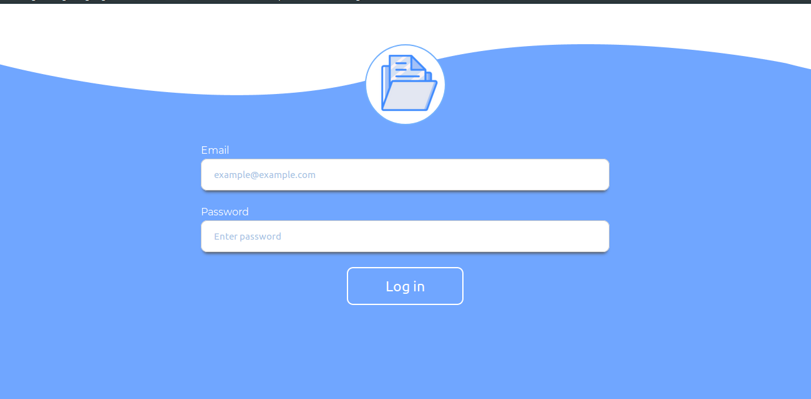
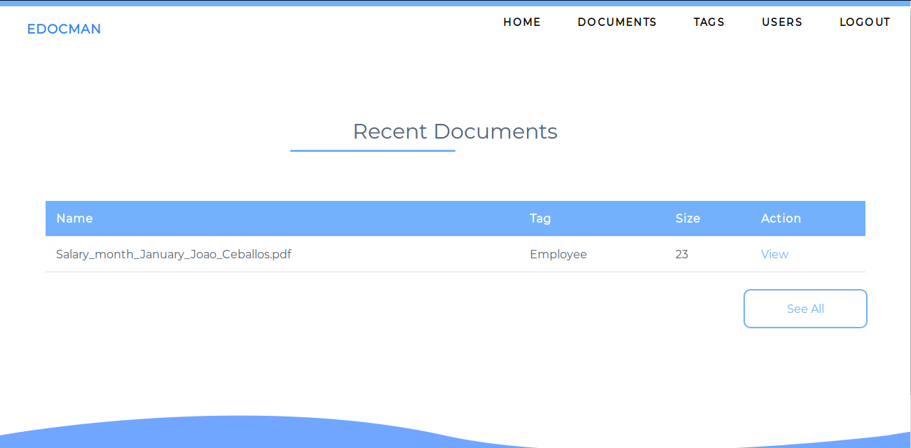
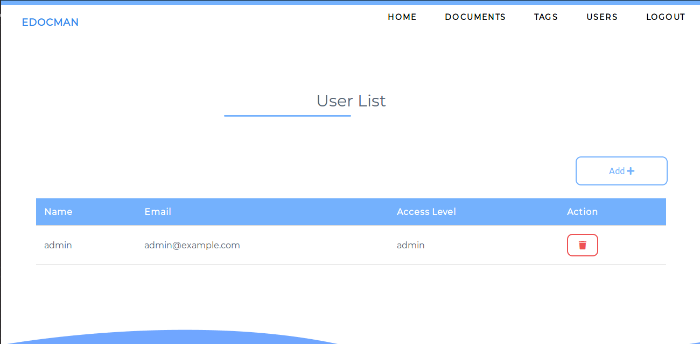
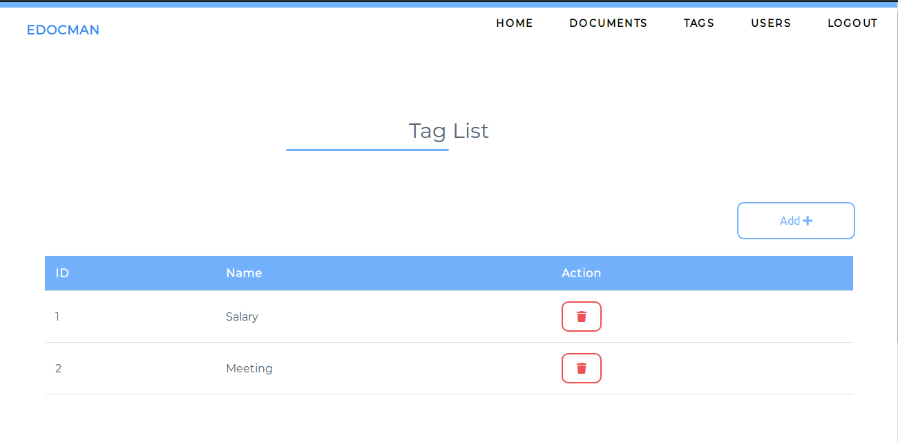
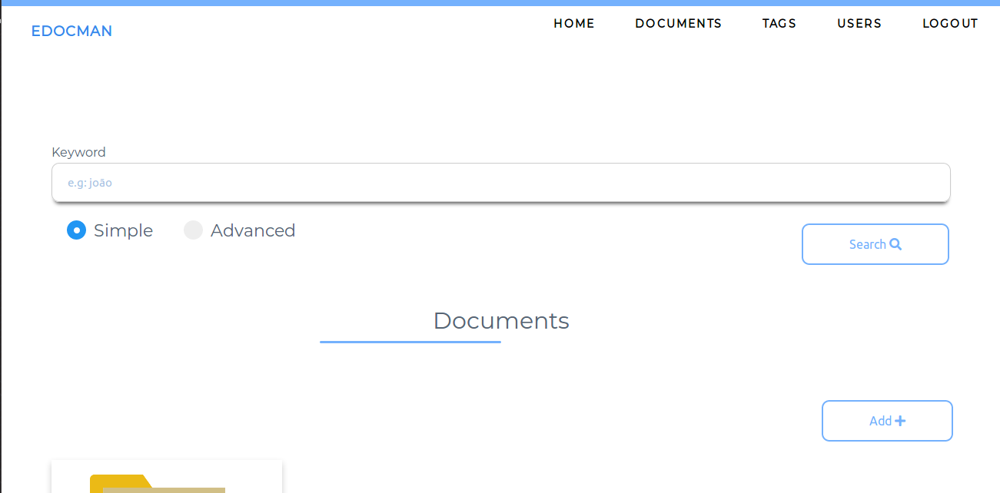

# edocman
Simple electronic document management system. Currently, the system only supports image files with the `.png`, `jpg` and `jpeg` extensions.
### Dependencies
- Operation System:
  - Linux :penguin:
- Tesseract OCR:
  - `sudo apt install tesseract-ocr libtesseract-dev -y`
- Database:
  - PostgreSQL :elephant:
- Composer
- PHP
  - php7.2, php7.2-pgsql and essential library.

### Setting the environment
- Creating database, tables and functions
  - Create a database with any name using the terminal or pgadmin. use the `db.sql` file to create the tables and functions.
- Setting up in-app database
  - To configure the database in the application, create an `.env` file by using the sample `.env.example` by adding information such as database name (`DBNAME`), user (`DBUSER`), password (`DBPASSWORD`), IP server that is running the database (`HOST`) if it is running locally use `localhost`, the port that the database is listening (`PORT`) and finally the `DRIVER` that in this case is pgsql.

### Running
Using the internal PHP server
```
php -S localhost:8080 -t public/
```

### Screenshots

Page Login

<p align="center">
  
</p>

<br><br>
Page Home

<p align="center">
  
</p>

<br><br>
Page Users (List user)

<p align="center">
  
</p>

<br><br>
Page Tags (List tag)

<p align="center">
  
</p>

<br><br>
Page Documents (List document)

<p align="center">
  
</p>